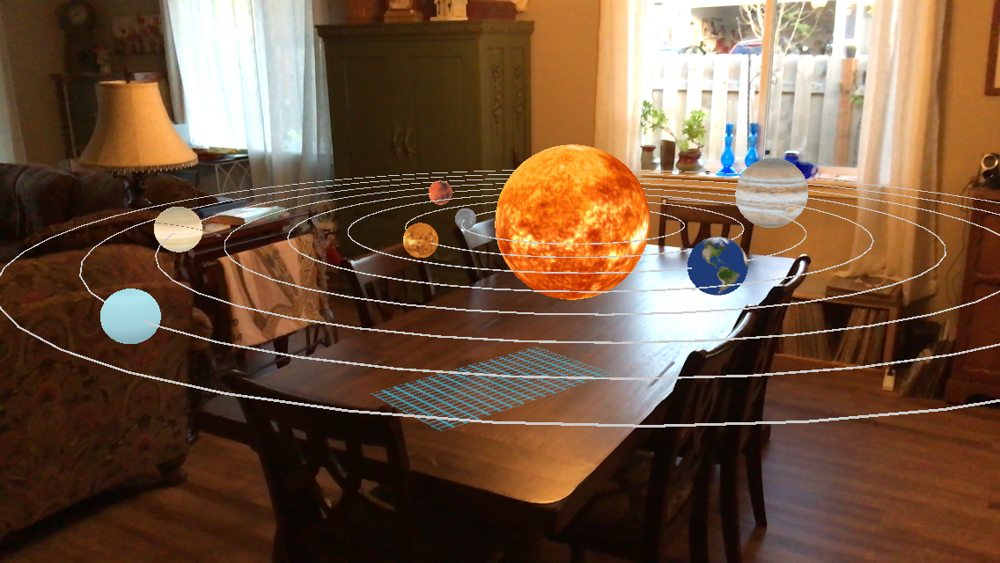
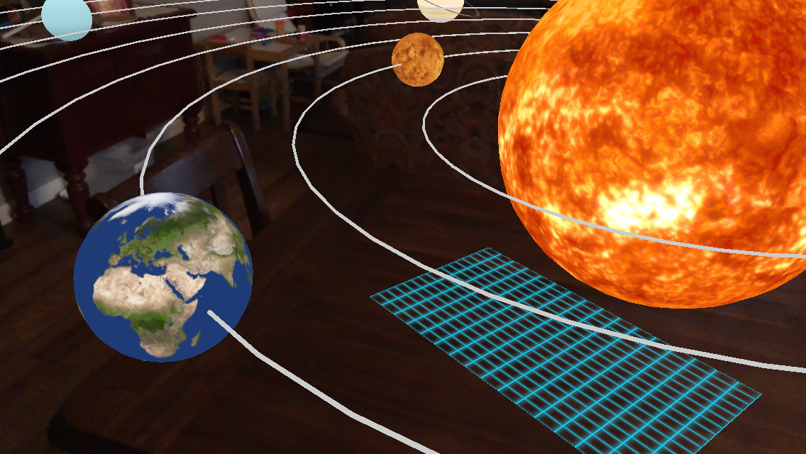

## Project Name
AR Solar System App

## Description
This little AR app will detect a plane and lay a blue grid on it. If you tap on the blue grid, it will place a solar system in the scene. This was a proof of concept app, it won't be released to the app store.

## Technologies
Swift, Xcode, ARKit, and Scenekit

## Usage
Download the repo from github. Open with Xcode. Run on a real device, because emulators don't seem to work with AR apps.

To use the code, you can clone the repository at [https://github.com/Mehequanna/AR-Orbits](https://github.com/Mehequanna/AR-Orbits).

## Author
Stephen Emery

## License
This work can be used under the MIT License.
Copyright (c) 2018 Stephen Emery
